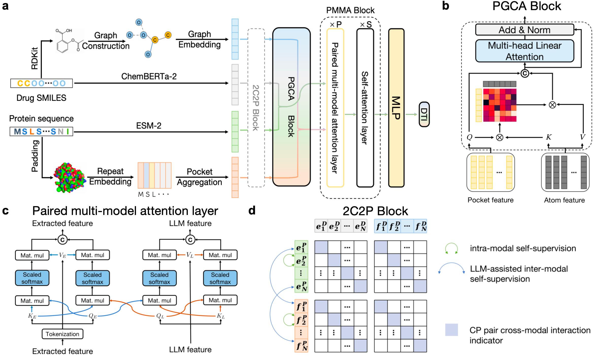

# Highly accurate and transferrable drug-target interaction prediction using multi-modal large language models
## Introduction
This repository hosts the PyTorch implementation of **DrugLAMP**, as outlined in our research manuscript titled "Highly accurate and transferrable drug-target interaction prediction using multi-modal large language models". **DrugLAMP** is introduced as an innovative system that leverages cutting-edge, pre-trained LLMs and graph models to extract structural affinity properties from drug-target pairs. It operates on multi-scale input modalities for performing prediction.
## Framework

## Environment Setup
### System Requirements
The source code developed in Python 3.10 using PyTorch 1.12.1. The following are the required Python dependencies. DrugLAMP is compatible with standard computers and operating systems (Windows/macOS/Linux) that have sufficient GPU to run. There are no additional non-standard hardware requirements. If you need to use an online experiment logging website, you can choose to install comet-ml.
```
torch==1.12.1
cudatoolkit==11.3
cudnn==8.3
dgl==1.0.2
dgllife==0.3.2
pyg==2.3.0
rdkit==2022.9.5
torchmetrics==0.11.4
pytorch-lightning==2.0.1.post0
transformers==4.28.1
fair-esm
comet-ml # optional
```
### Installation Guide
To begin, please clone the GitHub repository and proceed with the setup of a new conda environment. The installation process typically requires approximately one hour on a standard Linux server, although the exact duration may vary depending on the network speed.
```
# clone the source code of DrugLAMP
$ git clone https://github.com/Lzcstan/DrugLAMP.git
$ cd DrugLAMP

# create a new conda environment
$ conda env create -f env/drug_lamp.yml
$ conda activate drug_lamp

# install required python dependencies
$ pip install torch==1.12.1+cu113 torchvision==0.13.1+cu113 torchaudio==0.12.1 --extra-index-url https://download.pytorch.org/whl/cu113
$ conda install dgl=1.0.2 -c dglteam/label/cu113
$ pip install -r env/pip.txt
```
## Datasets
The `datasets` folder contains all experimental data used in DrugLAMP: [BindingDB](https://www.bindingdb.org/bind/index.jsp) [1], [BioSNAP](https://github.com/kexinhuang12345/MolTrans/tree/master/dataset/BIOSNAP/full_data) [2], [Human](https://github.com/lifanchen-simm/transformerCPI/blob/master/Human%2CC.elegans/dataset/human_data.txt) and [Kinase](https://github.com/lifanchen-simm/transformerCPI/tree/master/data) [3].
Within the folders `datasets/bindingdb`, `datasets/biosnap`, `datasets/human` and `datasets/kinase`, we possess distinct collections consisting of random split and real-world scenarios. These encompass both the cold-start and cluster-start split methodologies. By merging these collections, we are able to offer a comprehensive data resource that effectively caters to the experimental requirements within real-world contexts. The three random split scenarios provide standardized experimental settings that align with traditional machine learning approaches. The cold-start split specifically addresses ligand bias, while the cluster-start split evaluates the model's ability to generalize when there is a minimal overlap in the distribution of training and testing data.
## Reproduction

To train DrugLAMP, where we provide the basic configurations for all hyperparameters in `configs/default_config.py`. For different models for corresponding splits, the customized task configurations can be found in respective `configs/*.yaml` files.
When the environment following the installation guide steps is activated and the GPU is available, you can directly run the following command. `${dataset}` can be `bindingdb`, `biosnap`, `human` or `kinase`. `${split}` can be `random`, `cold` or `cluster`. `${model}` can be the model name, and `${id_list}` is the GPU id list separated by `,`. For all possible command combinations, please refer to the .sh file in the `scripts/` folder.
```
./scripts/${dataset}/${split}/${model}.sh ${id_list}
```
## Comet ML
[Comet ML](https://www.comet.com/site/) is an online platform for machine learning experimentation that enables researchers to track and monitor their ML experiments. We offer support for Comet ML to facilitate the monitoring of the training process within our code. This feature is **optional** and can be utilized by following the instructions below:

- Sign up [Comet](https://www.comet.com/site/) account and install its package using `pip3 install comet_ml`. 
- Please ensure that you generate your API key, then initialize use the command `comet init -a` and provide the key when prompted. This will write the key into the file named `.comet.config` located in your home directory (`~`). You can access the key through your account settings. The saved file follows the specified format:
```
[comet]
api_key=YOUR-API-KEY
```
- Set `_C.COMET.USE` to `True` and change `_C.COMET.WORKSPACE` in `configs/default_config.py` into the one that you created on Comet.
For more details, please refer the [official documentation](https://www.comet.com/docs/python-sdk/advanced/).

## Acknowledgements
This repository finds its inspiration in the preceding works:
- [DrugBAN](https://github.com/peizhenbai/DrugBAN)
- [x-clip](https://github.com/lucidrains/x-clip)
- [ESM](https://github.com/facebookresearch/esm)
- [ChemBERTa-2](https://github.com/seyonechithrananda/bert-loves-chemistry)
- [TransformerCPI](https://github.com/lifanchen-simm/transformerCPI)

## References
    [1] Liu, Tiqing, Yuhmei Lin, Xin Wen, Robert N. Jorissen, and Michael K. Gilson (2007). BindingDB: a web-accessible database of experimentally determined protein–ligand binding affinities. Nucleic acids research, 35(suppl_1), D198-D201.
    [2] Huang, Kexin, Cao Xiao, Lucas M. Glass, and Jimeng Sun (2021). MolTrans: Molecular Interaction Transformer for drug–target interaction prediction. Bioinformatics, 37(6), 830-836.
    [3] Chen, Lifan, et al (2020). TransformerCPI: improving compound–protein interaction prediction by sequence-based deep learning with self-attention mechanism and label reversal experiments. Bioinformatics, 36(16), 4406-4414.